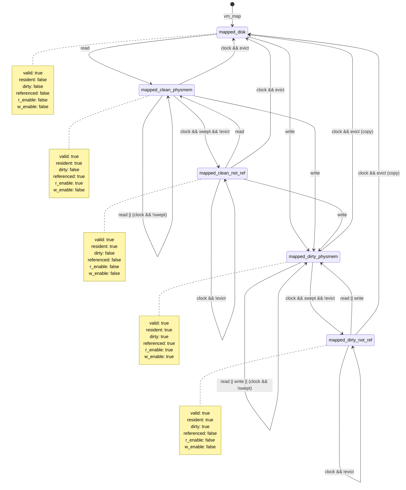

# EECS 482 Project 3: Pager

- Due Date: March 23, 2022

## Team Members

- Binhao Qin ([bhqin](mailto:bhqin@umich.edu))
- Gil Dhason ([adhason](mailto:adhason@umich.edu))
- Weili Li ([weilirs](mailto:weilirs@umich.edu))

## Schedule

- [x] Determine state-diagram for page life cycle (swap-backed and file-backed) (Thursday, Mar. 10-11)

- [x] State diagram check (OH or lab) (Thursday, Mar. 10, 2:30 p.m or Friday)

- [x] Functionality (life cycle) testing (Sunday, Mar. 13) (in parallel)

- [x] Determine class abstraction and data structure (Sunday, Mar. 13)

- [x] Implementation of basic features (Wednesday, Mar. 16)

- [x] Regressive testing (Sunday, Mar. 20) (in parallel)

- [x] Implementation of eviction, optimization, ... (Sunday, Mar. 20)

- [x] More testing (Wednesday, Mar. 23) (in parallel)

- [x] Wrapping up (Wednesday, Mar. 23)

## Notes and Questions

### State Diagram of Swap-backed Page

[Link to Online Document](https://app.creately.com/d/hnN2jWn8igc/edit)

### State Diagram of File-backed Page (Physical)

### Pager Structure

- `DiskBlock`: Data structure with file name and block number, implements hash.

- `Page`: Abstraction of a physical page, only fixed amount of presistent instances in pager. Contains metadata.
  - Need to be careful to update referer pointer whenever disk pointer is updated.
  - Call `broadcast` after shared state changes

- `AddressSpace`: Abstraction of a virtual address space. Implements virtual pointer, and syntax sugar of `Entry`.
  - valid and resident bits are not needed, therefore removed, only pointers of `DiskBlock` remain

- `Allocator`: Simple class for managing resources such as swap block and physical page.

- `Clock`: Implementation of clock algorithm, uses `unordered_map` and `list` for `O(1)` time complexity and `O(n)` memory

- `Pager`: Singleton class. A pager contains many tables for different associations and manages these association and invariants.

### Invariants

- There is only one physical instance of `DiskBlock`

- Referer pointer and disk pointer must be synchronize

- A non-resident page must have zero ppn and null disk and referer pointer

- Having non-null disk and referer pointer with zero ppn indicates a swap-backed page in zero-page

- Zero page is never evicted

## Notes on Workflow

1. Add header files under `include` and add source files under `src`.

2. Run `make syntax` before adding and commiting code and fix any error.

3. Use `git add -u` and `git add <file>`, don't do `git add .`.

4. Don't commit configuration files, temp files and build files. You can use `.gitignore` to prevent this.

5. Do a `git pull` or `git pull --rebase` before pushing.
